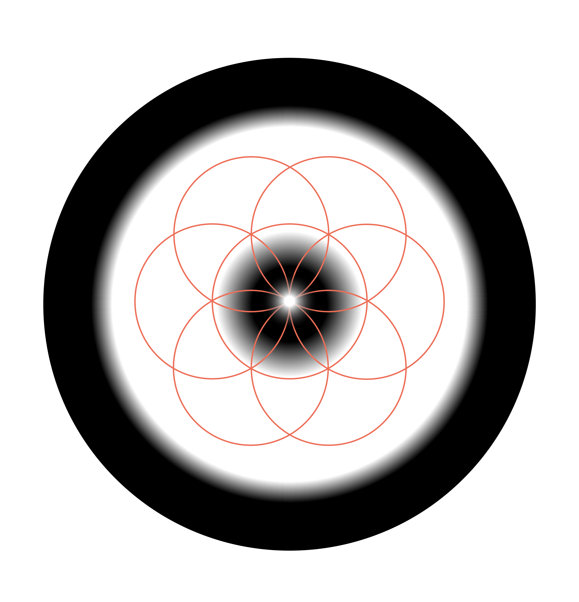

# Love

Fear and love are viewed as the fundamental energetic fabric of reality. Love enables the highest expression of the unity principle, representing a divine perception where reality is seen as an unbroken wholeness rather than separate parts interacting. Love entails a melting down of barriers and separation, fostering a deep inter-being with all of reality, including human and non-human beings. It is characterized by deep empathy and an intrinsic desire to give. Mystically, love can be understood as the one eternal idea in the mind of God, where all forms and phenomena in the world are manifestations of this singular, animating force of creation. Every other idea is a facet of the one infinite idea of love.